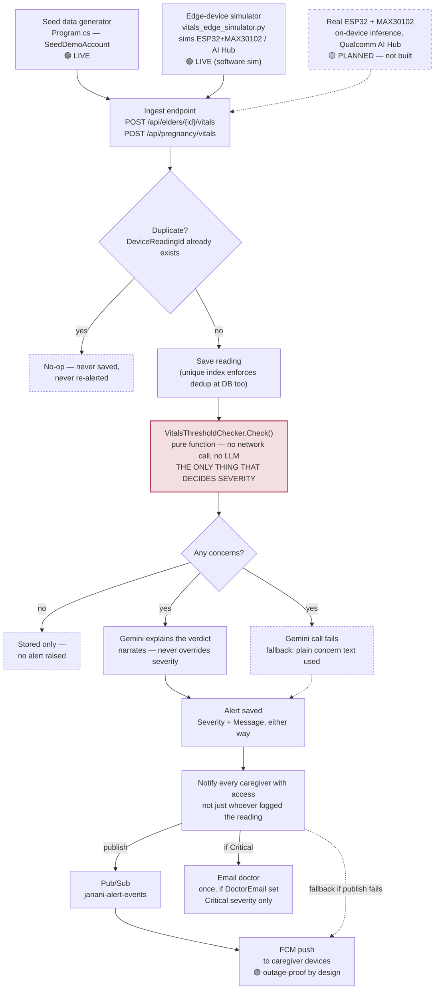

# The Vitals Pipeline, End to End

One ingestion path, whether the reading comes from seed data, the edge-device simulator, or — eventually — a real sensor.

> Styled version: [`html/architecture-vitals-pipeline.html`](html/architecture-vitals-pipeline.html)
> Companion doc: [`offline-first-design.md`](offline-first-design.md)

This is the mechanism the offline-first design doc argues for, drawn as it actually runs today. Every box below is real code (`VitalsIngestService`, `VitalsThresholdChecker`, `PushNotificationService`); the one dashed source node is the only thing on this page that doesn't exist yet.

## Pipeline

A reading from seed data, the edge-device simulator, or a future ESP32 all hit the same ingest endpoint. Dedup and severity are decided before any LLM call exists; Gemini only narrates, and a failed Gemini call still produces a saved, dispatched alert.

## Legend

- **Solid** — live code path, runs today
- **Dashed** — fallback, short-circuit, or not-yet-built
- **Highlighted node (`VitalsThresholdChecker`)** — the deterministic safety boundary; the only node that decides severity

## What this diagram is arguing

- **Three sources, one endpoint.** The seed generator and the edge simulator already produce the exact same request shape a real ESP32 will — the dashed node changes nothing downstream of the ingest endpoint when it arrives.
- **Dedup now happens twice.** `VitalsIngestService.IngestAsync` checks `DeviceReadingId` before insert, and a partial unique index (`WHERE "DeviceReadingId" IS NOT NULL`) backs it at the database — a retried upload from a flaky connection can't double-alert. 🟢 live
- **Ordering is still open.** The endpoint still assumes a device flushes its buffer in capture order after reconnecting; there's no server-side timestamp-reordering yet. 🔵 designed for, not built
- **Gemini sits after the decision, with its own fallback.** If the explain call throws, the code doesn't drop the alert — it falls back to the checker's own concern text and still saves and dispatches. The narration layer can fail without the safety layer failing.
- **Alerting fans out, it doesn't broadcast blindly.** Every caregiver with access gets pushed; only a Critical severity escalates to the doctor by email, and only once.
