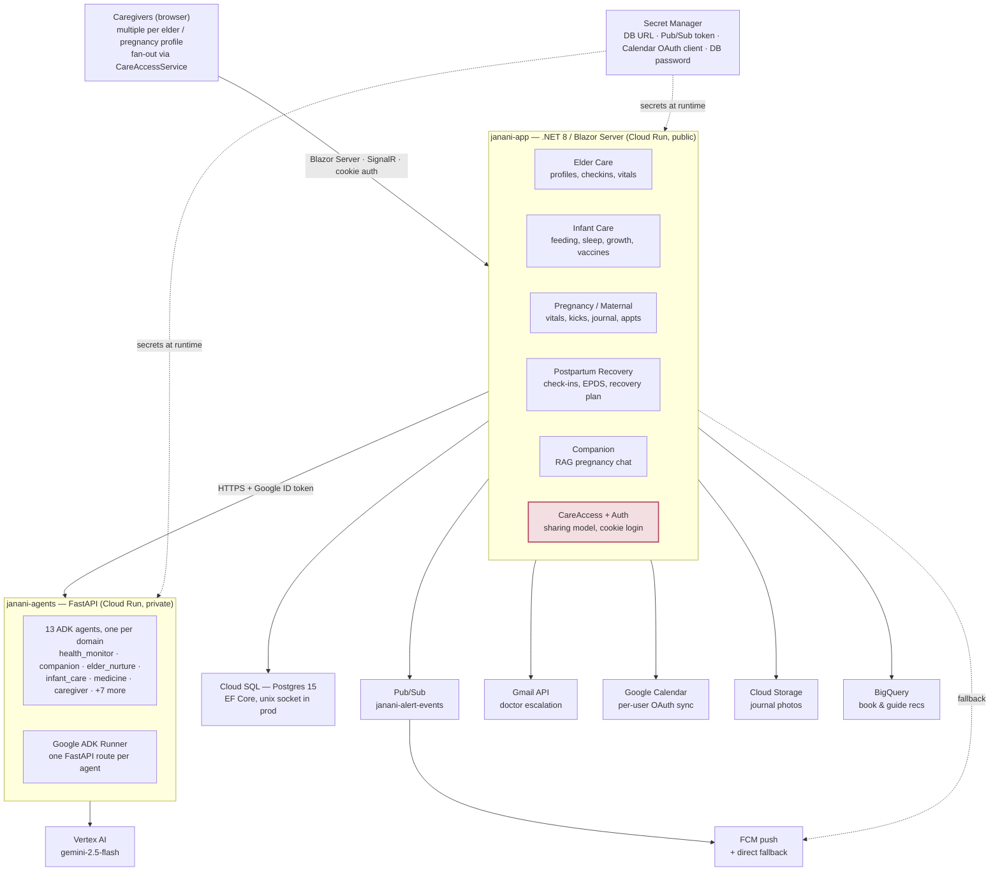

# Whole-System Architecture

Two Cloud Run services, thirteen Gemini agents, one shared Postgres — and the caregiver fan-out that sits underneath all of it.

> Styled version: [`html/architecture-whole-system.html`](html/architecture-whole-system.html)
> Zoomed-in view: [`architecture-vitals-pipeline.md`](architecture-vitals-pipeline.md)

This is the full picture, not just the vitals-monitoring slice. The vitals pipeline (dedup → deterministic checker → Gemini narration → Pub/Sub/FCM) is drawn in detail elsewhere — here it's one module among the ~20 that make up `janani-app`. This page shows how the whole system fits together: what talks to what, where the family-sharing model lives, and what's actually deployed today versus still a single-user roadmap item.

## System diagram

Two independently deployed Cloud Run services share one Postgres-backed caregiver graph. `janani-agents` is private and reachable only from `janani-app` with a Google ID token — no agent is exposed directly to a browser.

## Legend

- **`janani-app`** — public Cloud Run service (.NET 8 / Blazor Server)
- **`janani-agents`** — private Cloud Run service (FastAPI / Google ADK)
- **Plain boxes** — managed GCP infrastructure / third-party API
- **Dashed edges** — config/secret flow or a fallback path, not the primary request path

## The 13 agents

All run on `gemini-2.5-flash` via Vertex AI, each behind its own FastAPI route in `agents/main.py`. Every one of them narrates or drafts — none of them makes a safety-critical decision; that stays in the .NET checkers.

| Agent | Role |
|---|---|
| `health_monitor` | Explains flagged elder vitals concerns |
| `pregnancy_vitals` | Explains flagged pregnancy vitals concerns |
| `postpartum_recovery` | Explains postpartum / EPDS mental-health concerns |
| `companion` | Conversational RAG pregnancy assistant, own knowledge base |
| `elder_nurture` | Elder daily caregiving plan |
| `infant_care` | Infant daily plan |
| `day_nurture` | Daily plan from mood + pregnancy week |
| `meal` | Pregnancy-safe meal suggestions |
| `recipe` | Curated recipe catalog Q&A |
| `medicine` | Explains medicines, grounded in Google Search |
| `birth_plan` | Generates a birth plan document |
| `partner` | Drafts partner update messages |
| `caregiver` | Cross-profile Q&A + government entitlement lookup |
| `elder_tutor` | Phone/app help from a curated guide catalog |

## Auth & family sharing

Auth is plain ASP.NET Core cookie authentication with `PasswordHasher<TUser>` — there's no ASP.NET Identity framework and no Google login for end users. Google OAuth appears only per-user, scoped to Calendar and Gmail integrations.

The interesting part is **`CareAccessService`**: each elder or infant profile has one owning user, and `SharedCareAccess` rows grant additional caregivers access by username. This is what makes the whole vitals-alerting story work for a real household — `GetCaregiverUserIdsForElder/Infant` is what the alert dispatch (in the vitals pipeline diagram) fans out to, so a critical reading reaches every caregiver with access, not just whoever happened to be logged in when it came through.

## Deployment topology

**`janani-app`**
- Cloud Run, `--allow-unauthenticated`
- Owns the Postgres connection (Cloud SQL, unix socket)
- Calls `janani-agents` via `AGENT_SERVICE_URL`
- Attaches a Google ID token when `AGENT_SERVICE_REQUIRES_AUTH=true`, via `GoogleIdTokenHandler`

**`janani-agents`**
- Cloud Run, deployed `--no-allow-unauthenticated`
- Never called directly from a browser
- python:3.12-slim, FastAPI + uvicorn
- 13 ADK `Runner`s; most stateless per request, a few share a persistent session service

## Notification channels

Two channels exist today: FCM push (with the direct-fallback path covered in the vitals diagram) and Gmail API email for doctor escalation on critical alerts — Gmail, not SMTP or a transactional-email provider, since it goes out through a caregiver's own connected account. No SMS or WhatsApp channel exists.
